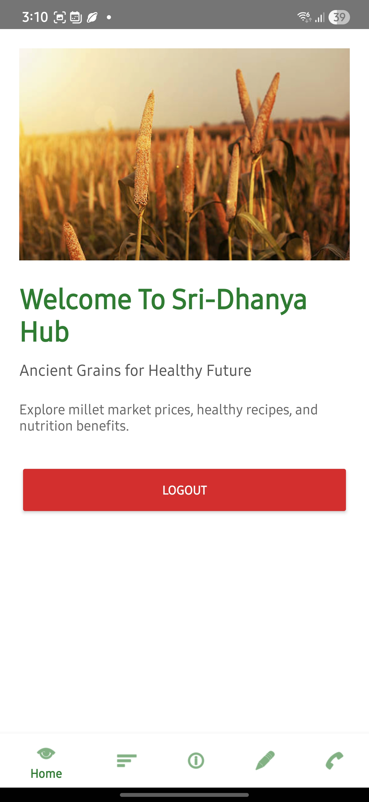
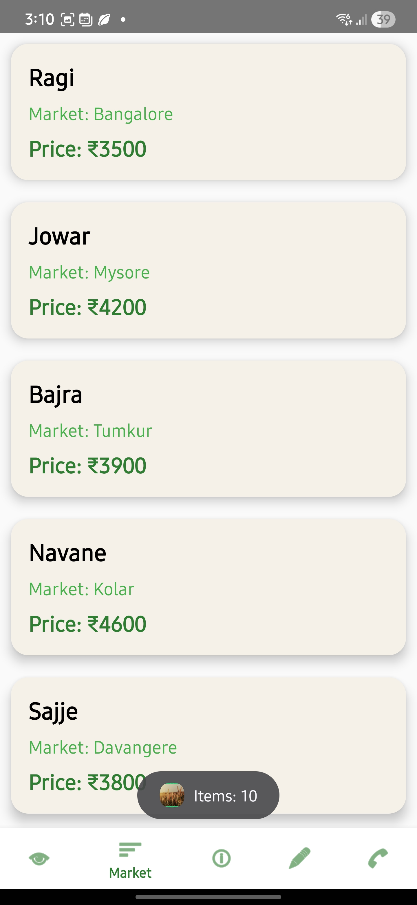
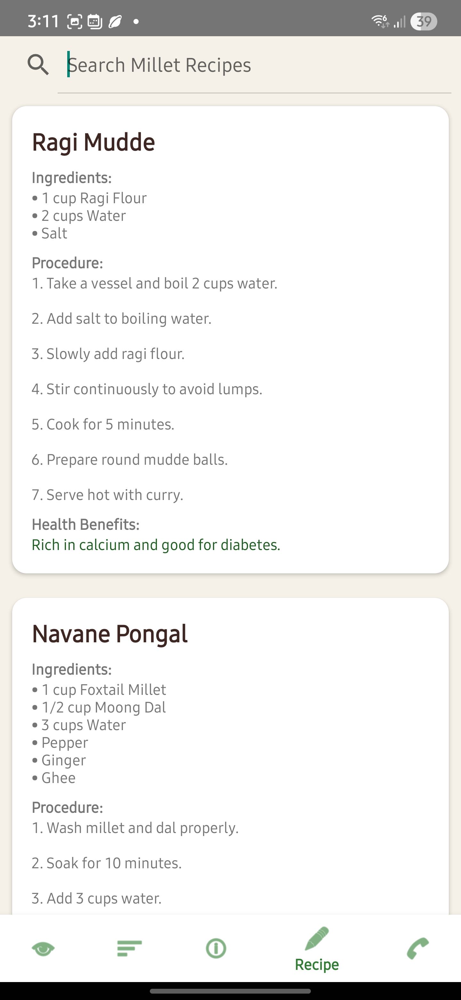
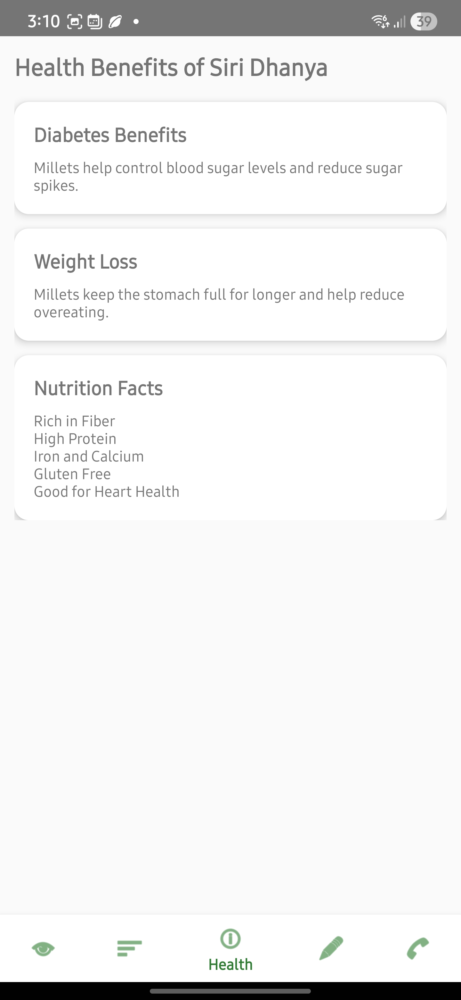
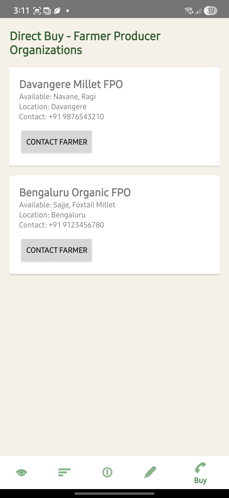

# 🌾 SiriDhanyaHub

## Ancient Grains for a Healthy Future

SiriDhanyaHub is a modern Android application developed using *Kotlin* in *Android Studio* to promote millet awareness, healthy food habits, and smart agriculture support.

The application helps users explore:
•⁠  ⁠🌱 Millet market prices
•⁠  ⁠🥗 Healthy millet recipes
•⁠  ⁠💪 Nutrition & health benefits
•⁠  ⁠🛒 Millet product purchasing

---

# 📱 Application Features

## 🔐 User Authentication
•⁠  ⁠User Registration
•⁠  ⁠Secure Login System
•⁠  ⁠Logout Functionality

## 🏠 Home Dashboard
•⁠  ⁠Beautiful millet-themed dashboard
•⁠  ⁠Smooth navigation interface

## 📈 Live Millet Market Prices
•⁠  ⁠Real-time market prices using MockAPI
•⁠  ⁠RecyclerView integration
•⁠  ⁠Dynamic API fetching with Retrofit

## 💪 Health Benefits Section
•⁠  ⁠Nutritional value of millets
•⁠  ⁠Healthy lifestyle awareness

## 🍲 Millet Recipe Section
•⁠  ⁠Traditional healthy millet recipes
•⁠  ⁠Easy-to-understand recipe cards

## 🛒 Direct Buy Section
•⁠  ⁠Millet product purchasing support
•⁠  ⁠Clean UI shopping interface

---

# 🛠️ Technologies Used

| Technology | Purpose |
|------------|----------|
| Kotlin | Android Development |
| Android Studio | IDE |
| XML | UI Design |
| Retrofit | API Integration |
| RecyclerView | Dynamic List |
| MockAPI | Online API |
| Material Design | Modern UI |

---

# 🌐 API Used

⁠ bash
https://6a042e1d2afe8349b4b6097f.mockapi.io/api/prices
 ⁠

---

# 📸 Application Screenshots

## 📝 Register Page

  

---

## 🔑 Login Page

  

---

## 🏠 Home Page

  

---

## 📈 Market Price Page

  

---

## 🍲 Recipe Page

  

---

## 💪 Health Benefits Page

  

---

## 🛒 Direct Buy Page

  

---

# 🚀 Project Highlights

•⁠  ⁠Modern Android UI
•⁠  ⁠Real-time API Integration
•⁠  ⁠User Authentication
•⁠  ⁠RecyclerView Implementation
•⁠  ⁠Fragment Navigation
•⁠  ⁠Responsive Layout Design
•⁠  ⁠Clean Architecture
•⁠  ⁠Material Design Components

---

# 📂 Project Structure

⁠ bash
app/
 ┣ java/com/example/siri_dhanyahub
 ┃ ┣ activities
 ┃ ┣ fragments
 ┃ ┣ adapters
 ┃ ┣ api
 ┃ ┗ models
 ┣ res/
 ┃ ┣ layout
 ┃ ┣ drawable
 ┃ ┣ mipmap
 ┃ ┗ values
 ⁠

---

# 🎯 Future Enhancements

•⁠  ⁠Firebase Authentication
•⁠  ⁠AI-based Millet Suggestions
•⁠  ⁠Dark Mode Support
•⁠  ⁠Multi-language Support
•⁠  ⁠Online Payment Gateway
•⁠  ⁠Farmer Marketplace Integration

---

# 👨‍💻 Developed By

## Akshay H

Electronics & Communication Engineering  
Android Developer | Kotlin Enthusiast

---

# ⭐ GitHub Repository

If you like this project, give it a ⭐ on GitHub.
